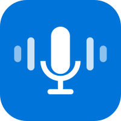
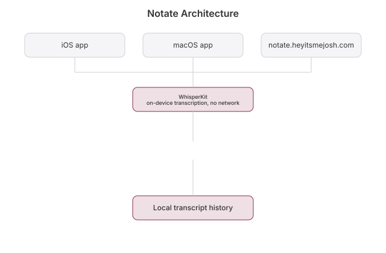

# Notate

   [](https://github.com/nulljosh/notate) [](https://www.producthunt.com/products/voxprint?launch=voxprint)

Speech to text that never leaves your device.

Native transcription on iPhone and Mac with [WhisperKit](https://github.com/argmaxinc/WhisperKit). No cloud. No API keys. Nothing uploaded, ever.

Live at [notate.heyitsmejosh.com](https://notate.heyitsmejosh.com) · [App Store](https://apps.apple.com/app/id6782604262)

<p align="center">
  
  
  
  
</p>


## Features

- Record live. Text and waveform appear as you talk
- Transcribe a file. Drag it in on Mac, browse on iOS
- Every language Whisper knows, about 99. Auto-detect, or pick one
- Picks the right model for your device's RAM
- History, the last 50
- Export, share, copy
- Heals itself. A broken model download gets wiped and fetched again, no error wall
- One dollar, once. No Pro tier, no in-app purchases, no subscription
- Cmd+R on Mac
- Light and dark
- SwiftUI on iOS and macOS
- Apple Watch companion, record voice memos standalone on your wrist

## Architecture



`AVAudioEngine` captures the mic at native rate and resamples to 16 kHz mono Float32. The waveform is RMS per buffer. Every 2 seconds a batch goes through WhisperKit's CoreML inference. File mode uses `AVAudioFile` for duration. History, capped at 50, persists to `Documents/echo-history.json`.

## Build

```bash
xcodegen generate
open voxprint.xcodeproj
```

Pick `Voxprint-iOS` or `Voxprint-macOS`. The Whisper model downloads once on first launch (about 39 MB tiny, 150 MB base, 500 MB small) into Application Support. After that it loads instantly. Auto mode picks the size for your device.

### Apple Watch

A standalone watchOS companion lives in `watchos/` (`WKWatchOnly`, no iPhone required to record). It records voice memos locally with `AVAudioRecorder` and keeps a history you can play back and delete, all on-device, nothing is transcribed or uploaded from the watch itself.

```bash
cd watchos
xcodegen generate
open VoxprintWatch.xcodeproj
```

## Test

```bash
xcodebuild test -scheme VoxprintTests -destination "platform=macOS" CODE_SIGNING_ALLOWED=NO
```

The real check is opt-in because it needs the network. It plants a corrupt model, makes the engine heal, then transcribes real speech:

```bash
TEST_RUNNER_VOXPRINT_QA=1 xcodebuild test -scheme VoxprintTests -destination "platform=macOS" CODE_SIGNING_ALLOWED=NO
```

`asc workflow run ship-ios` and `ship-mac` run it first. If it fails, nothing ships.

## Roadmap

Lives in [roadmap.md](roadmap.md). Next up: tiny model bundled in the app so first launch needs no download.

## License

MIT 2026, Joshua Trommel

## Whitepaper

[Technical whitepaper](WHITEPAPER.md)
