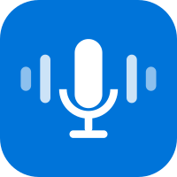
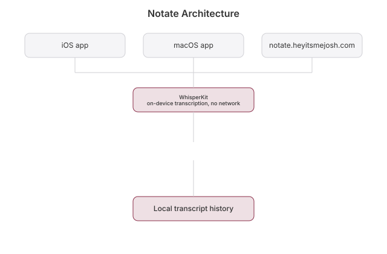

# Notate

   [](https://github.com/nulljosh/notate) [](https://www.producthunt.com/products/voxprint?launch=voxprint)

Speech to text that never leaves your device.

Native transcription on iPhone and Mac with [WhisperKit](https://github.com/argmaxinc/WhisperKit). No cloud. No API keys. Nothing uploaded, ever.

Live at [notate.heyitsmejosh.com](https://notate.heyitsmejosh.com) · [App Store](https://apps.apple.com/app/id6782604262)

<p align="center">
  
  
  
  
</p>


## Features

- Record live. Text and waveform appear as you talk
- Transcribe a file. Drag it in on Mac, browse on iOS
- Every language Whisper knows, about 99. Auto-detect, or pick one
- Works the moment it opens, even offline. A small model ships in the app; the right model for your device's RAM downloads quietly and swaps in between recordings (1.4.2)
- Custom words. Names, places and jargon spelled your way (1.4.2)
- One-tap cleanup with Apple's on-device model: punctuation, grammar, no more ums (1.4.2, needs Apple Intelligence)
- History, the last 50
- Export, share, copy
- Heals itself. A broken model gets wiped, Notate drops back to the built-in model, and the good one is fetched again. No error wall
- One dollar, once. No Pro tier, no in-app purchases, no subscription
- Cmd+R on Mac
- Light and dark
- SwiftUI on iOS and macOS
- Apple Watch companion, record voice memos standalone on your wrist

## Architecture



`AVAudioEngine` captures the mic at native rate and resamples to 16 kHz mono Float32. The waveform is RMS per buffer. Every 2 seconds a batch goes through WhisperKit's CoreML inference. File mode uses `AVAudioFile` for duration. History, capped at 50, persists to `Documents/echo-history.json`.

## Build

```bash
xcodegen generate
open voxprint.xcodeproj
```

Pick `Voxprint-iOS` or `Voxprint-macOS`. The Whisper model downloads once on first launch (about 39 MB tiny, 150 MB base, 500 MB small) into Application Support. After that it loads instantly. Auto mode picks the size for your device.

### Apple Watch

A standalone watchOS companion lives in `watchos/` (`WKWatchOnly`, no iPhone required to record). It records voice memos locally with `AVAudioRecorder` and keeps a history you can play back and delete, all on-device, nothing is transcribed or uploaded from the watch itself.

```bash
cd watchos
xcodegen generate
open VoxprintWatch.xcodeproj
```

## Test

```bash
xcodebuild test -scheme VoxprintTests -destination "platform=macOS" CODE_SIGNING_ALLOWED=NO
```

The real check is opt-in. It plants a corrupt model and makes the engine heal, proves a broken model falls back to the built-in one, proves custom words never blank the output, transcribes real speech, and runs the on-device cleanup when the Mac has Apple Intelligence:

```bash
TEST_RUNNER_VOXPRINT_QA=1 xcodebuild test -scheme VoxprintTests -destination "platform=macOS" CODE_SIGNING_ALLOWED=NO
```

`asc workflow run ship-ios` and `ship-mac` run it first. If it fails, nothing ships.

## Roadmap

Lives in [roadmap.md](roadmap.md). Next up: a keyboard so you can dictate into any app.

## License

MIT 2026, Joshua Trommel

## Whitepaper

[Technical whitepaper](WHITEPAPER.md)
